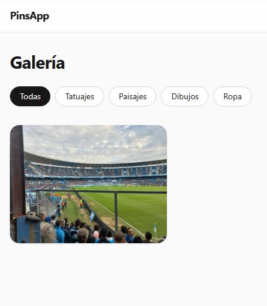
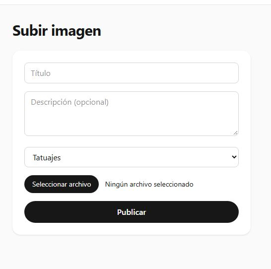
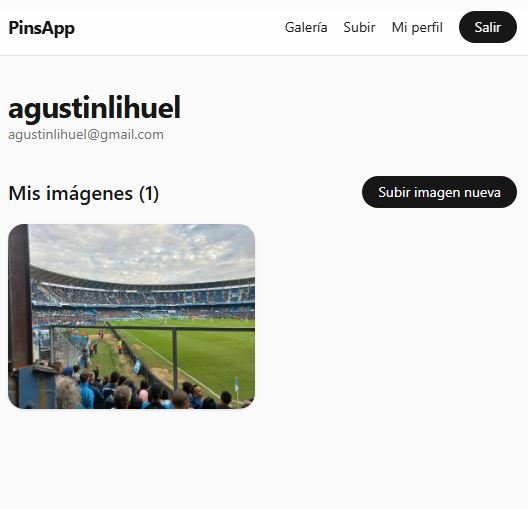

# PinsApp

Galería para exponer arte e imágenes propias, organizada por categorías: **tatuajes, paisajes, dibujos y ropa**. Cada persona se registra, sube su trabajo y lo muestra en una vista general tipo Pinterest.

🔗 **Demo en vivo:** https://full-stack-ts.vercel.app/



## Qué se puede hacer

- **Explorar la galería**: grilla tipo masonry, responsive (2, 3 o 4 columnas según el ancho), con el título y la categoría al pasar el mouse.
- **Filtrar por categoría**: tatuajes, paisajes, dibujos o ropa, con un click.
- **Subir imágenes propias**: formulario con título, descripción, categoría y archivo (JPG, PNG o WebP).
- **Mi perfil**: espacio personal con todas tus publicaciones y la opción de borrarlas.
- **Cuentas de usuario**: registro, login y logout. La galería es pública; subir y borrar requiere sesión.

| Galería | Subir imagen | Mi perfil |
|---|---|---|
|  |  |  |

---

## Detalles técnicos

Aplicación full-stack con tipado end-to-end: los tipos viajan desde el esquema de la base de datos hasta los componentes de React, sin interfaces duplicadas ni `any`.

### Stack

| Capa | Tecnología |
|---|---|
| Frontend | Next.js 16 (App Router), React, TypeScript, Tailwind CSS v4 |
| API | tRPC (routers, procedures y middleware) |
| Validación | Zod (los tipos se infieren de los schemas) |
| Base de datos | PostgreSQL en Supabase + Drizzle ORM |
| Autenticación | Supabase Auth con `@supabase/ssr` (sesión por cookies) |
| Archivos | Supabase Storage |
| Testing | Vitest |
| Deploy | Vercel |

### Arquitectura

```
Cliente (React)  ──▶  tRPC (Zod)  ──▶  Drizzle ORM  ──▶  Supabase Postgres (RLS)
       │                  │
       └──── Supabase Auth (cookies + JWT) ────┘
       └──── Supabase Storage (subida directa del archivo) ──▶ bucket "pins"
```

Flujo al publicar una imagen:

1. El navegador sube el archivo a Storage, en la carpeta `<user-id>/`.
2. Con la URL resultante llama a `trpc.pin.create`.
3. `createContext` valida la sesión con `supabase.auth.getUser()` y expone `ctx.user`.
4. El middleware `isAuthed` corta con `401 UNAUTHORIZED` si no hay sesión.
5. Zod valida el input y Drizzle inserta la fila. El `authorId` sale de `ctx.user.id`, nunca del cliente.

### Modelo de datos

- `profiles`: usuarios (su `id` es el mismo que el de `auth.users`). Un trigger en Postgres lo crea automáticamente al registrarse.
- `pins`: imágenes, con `category` como `ENUM` de Postgres y FK a `profiles` con `ON DELETE CASCADE`.
- `posts`: tabla del módulo inicial, conservada junto con sus tests.

Las migraciones generadas están en [`/drizzle`](./drizzle) y el SQL manual (RLS, trigger, Storage) en [`/drizzle/manual`](./drizzle/manual).

### API tRPC

| Procedimiento | Acceso | Descripción |
|---|---|---|
| `pin.getAll` | Público | Lista pins, con filtro opcional por categoría o autor |
| `pin.getMine` | Protegido | Pins del usuario logueado |
| `pin.create` | Protegido | Crea un pin y valida que el archivo esté en la carpeta del usuario |
| `pin.delete` | Protegido | Borra un pin propio (filtra por `ctx.user.id`) |
| `user.me` | Público | Usuario de la sesión o `null` |
| `post.*`, `user.*` | Mixto | Procedimientos del módulo inicial |

### Seguridad en capas

1. **Proxy de Next.js**: redirige a `/login` si se accede a una ruta protegida sin sesión.
2. **tRPC `protectedProcedure`**: devuelve `401` sin sesión, y el autor siempre sale de la sesión del servidor.
3. **Row Level Security en Postgres**: políticas con `auth.uid()` en `profiles`, `posts` y `pins`. Lectura pública, escritura solo del dueño.
4. **Storage con RLS**: cada usuario solo puede subir y borrar dentro de su propia carpeta.


> Drizzle se conecta con un rol privilegiado que no pasa por RLS, por eso `protectedProcedure` es el control principal para las consultas del backend. RLS protege el acceso directo a la base con la clave pública.

### Correr en local

```bash
git clone https://github.com/AgustinRodriguez23/Full-Stack-TS.git
cd Full-Stack-TS
npm install
cp .env.example .env   # completar con tus credenciales de Supabase
npx drizzle-kit migrate
npm run dev
```

Variables de entorno (ver `.env.example`):

```
DATABASE_URL=postgresql://...            # Transaction pooler (puerto 6543)
NEXT_PUBLIC_SUPABASE_URL=https://<proyecto>.supabase.co
NEXT_PUBLIC_SUPABASE_ANON_KEY=<publishable key>
```

> Usá la **publishable/anon key** en `NEXT_PUBLIC_SUPABASE_ANON_KEY`, nunca una secret key: las variables `NEXT_PUBLIC_` quedan visibles en el navegador.

### Tests

```bash
npm test
```

Verifica con Vitest que el `ON DELETE CASCADE` elimine los posts al borrar un perfil. Corre contra la base real de Supabase.

### Deploy

El proyecto se despliega en Vercel desde `main`, con las variables de entorno cargadas en el panel (`DATABASE_URL` como Secret y las `NEXT_PUBLIC_*` como Config). Las ramas generan previews automáticos.

## Contacto

**Agustín Rodríguez** · Desarrollador full stack

📧 agustinlihuel@gmail.com
💼 [LinkedIn](https://www.linkedin.com/in/agustin-lihuel-rodr%C3%ADguez-9968b7353/)
🐙 [GitHub](https://github.com/AgustinRodriguez23)