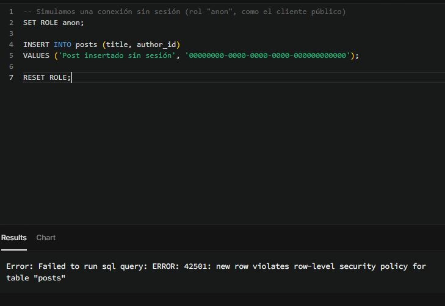

## Esquema de base de datos

Se definieron dos tablas relacionadas en Drizzle ORM: `profiles` (usuarios) 
y `posts` (publicaciones), con una relación 1-a-muchos mediante foreign key 
(`posts.author_id` → `profiles.id`, `ON DELETE CASCADE`).

### Evidencia en Supabase

## Verificación de la relación (Foreign Key + Cascade)

Además de validar el esquema en Supabase, se corrió un script de prueba 
(`src/db/test-cascade.ts`) para confirmar en la práctica que el `ON DELETE CASCADE` 
funciona correctamente:

1. Se crea un `profile` de prueba.
2. Se crea un `post` asociado a ese `profile` (vía `authorId`).
3. Se confirma que el `post` existe.
4. Se borra el `profile`.
5. Se confirma que el `post` fue eliminado automáticamente por Postgres, 
   sin necesidad de borrarlo manualmente desde el código.

### Resultado del test

✅ Profile creado: { id: '...', username: 'test-cascade-user', createdAt: ... }
✅ Post creado: { id: 1, title: 'Post de prueba', ... }
📋 Posts antes del delete: 1
🗑️  Profile borrado
📋 Posts después del delete: 0
✅ CASCADE funcionó correctamente

Para correr el test:

~~~bash
npx tsx tests/test-cascade.ts
~~~

## API tRPC — Validación con Zod

Se implementaron dos routers de dominio (`user` y `post`), con procedimientos
de lectura (query) y escritura (mutation), validados con Zod:

- `user.getUsers` — trae todos los perfiles.
- `user.createUser` — crea un perfil (valida `username` no vacío). Requiere sesión activa; el `id` del perfil se toma de la sesión (mismo UUID que `auth.users`).
- `post.getPosts` — trae posts, con filtros opcionales por `authorId` y `published`.
- `post.createPost` — crea un post (valida `title` de 5-100 caracteres). Requiere sesión activa (`protectedProcedure`); el `authorId` se toma de la sesión, no del input.

### Probar los endpoints

Con `npm run dev` corriendo:

- GET `http://localhost:3000/api/trpc/post.getPosts` (pública, no requiere sesión)
- GET `http://localhost:3000/api/trpc/post.getMyPosts` (protegida, requiere sesión activa — devuelve `401 UNAUTHORIZED` sin ella)
- POST `http://localhost:3000/api/trpc/post.createPost` (protegida, requiere sesión). Body:
  \`\`\`json
  { "title": "Mi post" }
  \`\`\`
  El `authorId` se asigna automáticamente desde la sesión (`ctx.user.id`), no se envía en el body.

Un `title` de menos de 5 caracteres devuelve `400 BAD_REQUEST` con el detalle
del error de validación de Zod. Un request sin sesión activa a un
procedimiento protegido devuelve `401 UNAUTHORIZED`.

## Cliente tRPC (Frontend)

Se implementó un Provider de tRPC + React Query en `src/lib/trpc/Provider.tsx`,
integrado en el layout raíz (`src/app/layout.tsx`). La página `/posts` 
(`src/app/posts/page.tsx`) consume:

- `trpc.post.getPosts.useQuery()` — lista los posts, tipado automáticamente
  desde el `appRouter` del servidor.
- `trpc.post.createPost.useMutation()` — crea un post, con validación Zod
  visible en tiempo real en el formulario (ej: título de menos de 5 caracteres
  muestra el error del servidor en pantalla).

## Testing

Se reemplazó el script de prueba por defecto por **Vitest**:

\`\`\`bash
npm test
\`\`\`

Test incluido: `tests/cascade-delete.test.ts`, que verifica que al borrar un
`profile`, sus `posts` asociados se eliminan automáticamente por el
`ON DELETE CASCADE` definido en el schema de Drizzle.

> Nota: este test corre contra la base de datos real de Supabase (crea y borra
> sus propios datos de prueba). Para un entorno de CI más robusto, el siguiente
> paso sería aislarlo con una base de datos de testing dedicada.

## Autenticación con Supabase Auth

Se implementó autenticación completa usando `@supabase/ssr`, con tres 
clientes especializados según el contexto de ejecución:

- `src/lib/supabase/client.ts` — cliente para Client Components (browser).
- `src/lib/supabase/server.ts` — cliente para Server Components y Server 
  Actions, con lectura/escritura de cookies vía `next/headers`.
- `src/lib/supabase/middleware.ts` — cliente para el Proxy (ex-Middleware), 
  que refresca la sesión y valida al usuario con `supabase.auth.getUser()` 
  en cada request.

### Protección de rutas

`src/proxy.ts` intercepta todas las requests (excepto assets estáticos) y 
redirige a `/login` si el usuario intenta acceder a una ruta protegida 
(`/dashboard`) sin sesión válida. La página `/dashboard` además valida la 
sesión en el propio Server Component como segunda capa de seguridad.

### Flujo de usuario

- **`/login`** — formulario con dos acciones (`login` y `signup`), 
  implementadas como Server Actions en `src/app/login/actions.ts`.
- **`/dashboard`** — ruta protegida que muestra el email del usuario 
  logueado y un botón de logout.

### Probar el flujo

1. Con `npm run dev` corriendo, andá a `http://localhost:3000/login`.
2. Registrate con un email y contraseña (mínimo 6 caracteres).
3. Si la confirmación de email está desactivada en el dashboard de Supabase 
   (Authentication → Providers → Email), el login te lleva directo a 
   `/dashboard`.
4. Probá entrar a `/dashboard` en una ventana de incógnito (sin sesión): 
   el Proxy te redirige automáticamente a `/login`.

### Variables de entorno necesarias

\`\`\`
NEXT_PUBLIC_SUPABASE_URL=https://tu-proyecto.supabase.co
NEXT_PUBLIC_SUPABASE_ANON_KEY=tu-anon-key
\`\`\`

> Importante: la URL debe ser la "Project URL" base del dashboard de 
> Supabase (Project Settings → API), sin sufijos como `/rest/v1`.

## Seguridad: tRPC protegido + Row Level Security (RLS)

Se agregó una capa de seguridad en dos niveles independientes: autorización 
en la API (tRPC) y autorización en la base de datos (Postgres RLS).

### Contexto enriquecido con sesión

`src/lib/trpc/context.ts` obtiene el usuario autenticado leyendo las cookies 
de sesión vía `@supabase/ssr` y `supabase.auth.getUser()` (valida el JWT 
contra el servidor, no confía en la cookie a ciegas). El resultado (`User` 
o `null`) se expone como `ctx.user` en todos los procedimientos.

### `protectedProcedure`

En `src/lib/trpc/server.ts` se definió un middleware `isAuthed` que corta 
la ejecución con `TRPCError({ code: 'UNAUTHORIZED' })` si `ctx.user` es 
`null`, antes de que el resolver toque la base de datos. `protectedProcedure` 
combina el procedure base con este middleware, y además hace *type narrowing*: 
dentro de un `protectedProcedure`, `ctx.user` ya no puede ser `null` según 
TypeScript.

Procedimientos migrados a `protectedProcedure`:

- `user.createUser` — el `id` del profile se toma de `ctx.user.id` 
  (mismo UUID que `auth.users`), no de un input.
- `post.createPost` — el `authorId` se toma de `ctx.user.id`, nunca del 
  body que manda el cliente.

Las queries de lectura (`getUsers`, `getPosts`) siguen siendo 
`publicProcedure`, por diseño: la lectura es pública, la escritura requiere 
sesión.

### Row Level Security (RLS)

Se habilitó RLS en `profiles` y `posts`, con políticas basadas en 
`auth.uid()`. El SQL aplicado está versionado en 
`drizzle/manual/0001_enable_rls.sql`:

\`\`\`sql
ALTER TABLE "profiles" ENABLE ROW LEVEL SECURITY;
ALTER TABLE "posts" ENABLE ROW LEVEL SECURITY;

CREATE POLICY "Los usuarios solo pueden crear posts propios"
  ON "posts" FOR INSERT
  WITH CHECK (auth.uid() = author_id);
-- (resto de políticas en el archivo completo)
\`\`\`

**Nota sobre el alcance de RLS:** la conexión de Drizzle (`DATABASE_URL`) 
usa un rol con privilegios elevados que no pasa por RLS — por eso 
`protectedProcedure` es el control principal para las queries que hace 
el propio backend. RLS actúa como segunda capa, protegiendo el escenario 
en que alguien acceda directo a la base con la Anon Key (por ejemplo, 
desde `@supabase/ssr` en el browser), sin pasar por la API de tRPC. Es 
defensa en profundidad: dos capas independientes cubriendo vectores de 
ataque distintos.

### Probar la protección

Sin sesión, con Thunder Client (no manda cookies del navegador):

\`\`\`
POST http://localhost:3000/api/trpc/post.createPost
Body: { "title": "Post sin sesión" }
\`\`\`

Devuelve `401 UNAUTHORIZED`:

\`\`\`json
{
  "error": {
    "message": "Debés iniciar sesión para realizar esta acción",
    "data": { "code": "UNAUTHORIZED", "httpStatus": 401 }
  }
}
\`\`\`

Con sesión (logueado en `/login`, desde la consola del navegador en 
`/dashboard`):

\`\`\`javascript
fetch('/api/trpc/post.createPost', {
  method: 'POST',
  headers: { 'Content-Type': 'application/json' },
  body: JSON.stringify({ title: 'Post con sesión válida' }),
  credentials: 'include',
}).then(r => r.json()).then(console.log);
\`\`\`

Devuelve el post creado con `authorId` igual al `id` del usuario logueado.

## Evidencia RLS funcionando

